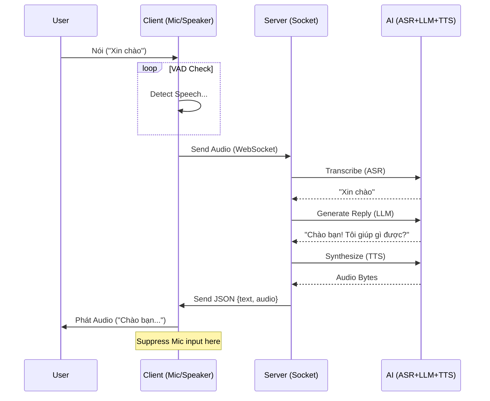

# Cấu Trúc Luồng Project Speech-to-Speech (English-only)

Dưới đây là mô tả chi tiết về cấu trúc và luồng dữ liệu của hệ thống Speech-to-Speech (S2S) bạn đang chạy.

## 1. Kiến Trúc Tổng Quan (System Architecture)

Hệ thống hoạt động theo mô hình **Client-Server** qua giao thức **WebSocket**.

*   **Client (`s2s_client.py`)**: Chạy trên máy người dùng (hoặc robot/trong thiết bị). Có nhiệm vụ thu âm, phát hiện tiếng nói (VAD), và phát âm thanh trả về.
*   **Server (`run_server.py` + `speech_pipeline/websocket_server.py`)**: Chạy trên máy chủ (GPU). Có nhiệm vụ xử lý nặng: nhận diện giọng nói (ASR), xử lý ngôn ngữ (LLM), và tổng hợp tiếng nói (TTS).

```mermaid
graph TD
    User((User)) <--> |Audio in/out| Client[Client (s2s_client.py)]
    Client <--> |WebSocket (JSON + Audio)| Server[Server (speech_pipeline/websocket_server.py)]
    
    subgraph "Server Components"
        ServerVAD[Server VAD]
        ASR[ASR (Whisper)]
        LLM[LLM (Qwen3-8B)]
        TTS[TTS (Edge-TTS - English)]
    end
    
    Server --> ServerVAD --> ASR --> LLM --> TTS --> Server
```

## 2. Chi Tiết Luồng Dữ Liệu (Data Flow)

### Bước 1: Thu Âm & Phát Hiện Tiếng Nói (Client-Side)
1.  **Microphone** thu âm liên tục (16kHz).
2.  **Client VAD** (Silero) phân tích từng chunk audio nhỏ (32ms).
3.  Khi phát hiện tiếng nói bắt đầu -> Bắt đầu ghi buffer.
4.  Khi phát hiện khoảng lặng (silence) kéo dài (ví dụ 800ms) -> Kết thúc câu nói.
5.  **Client** gửi gói tin `{"type": "audio", "data": "base64..."}` chứa toàn bộ câu nói lên Server.

### Bước 2: Xử Lý Tại Server
1.  **Server** nhận gói tin Audio.
2.  *(Hiện tại)*: Server đưa vào buffer xử lý (có thể kiểm tra VAD lại hoặc xử lý ngay).
3.  **ASR (Speech-to-Text)**: Chuyển đổi âm thanh thành văn bản tiếng Anh.
    *   Dùng *Whisper* (Transformers).
4.  **LLM (Text Generation)**:
    *   Nhận văn bản từ ASR.
    *   Kèm theo lịch sử hội thoại (History).
    *   Kiểm tra xem có cần tìm kiếm Web không (nhờ hàm `detect_search_intent`).
    *   Sinh câu trả lời (Response) dạng text (đã được làm sạch Markdown).
5.  **TTS (Text-to-Speech)**:
    *   Chuyển câu trả lời của LLM thành âm thanh.
    *   Dùng *Edge-TTS* (English voice).

### Bước 3: Phản Hồi & Phát Lại (Client-Side)
1.  **Server** gửi gói tin `{"type": "response", "text": "...", "audio": "..."}` về Client.
2.  **Client** nhận gói tin:
    *   Hiển thị text lên màn hình.
    *   Đưa audio vào hàng đợi phát (Audio Player).
3.  **Playback Suppression** (Chống Lặp/Vọng):
    *   Trong khi loa đang phát âm thanh của AI, Client sẽ **giảm gain** (độ nhạy) của Microphone hoặc bỏ qua input.
    *   Việc này giúp AI không tự nghe lại tiếng của chính mình ("Double-talk handling").

## 3. Cấu Trúc File & Module

```
project/
├── run_server.py          # [MAIN] Entrypoint chạy server FastAPI
├── s2s_client.py          # [MAIN] Client thu/phát âm thanh
├── requirements_speech.txt # Các thư viện cần thiết
│
├── speech_pipeline/       # Các module xử lý lõi (được import bởi server)
│   ├── __init__.py
│   ├── config.py          # Cấu hình (paths, constants)
│   ├── asr.py             # Wrapper cho Whisper
│   ├── llm.py             # Wrapper cho Qwen (Streaming, Search, History)
│   ├── tts.py             # Wrapper cho Edge-TTS
│   ├── vad.py             # Wrapper cho Silero VAD
│   └── pipeline.py        # Class quản lý logic nối các module (nếu dùng tách biệt)
│
├── models/                # Thư mục chứa weights model
│   ├── Qwen_Qwen3-8B/
│   └── ...
```

## 4. Sequence Diagram (Tuần Tự)


